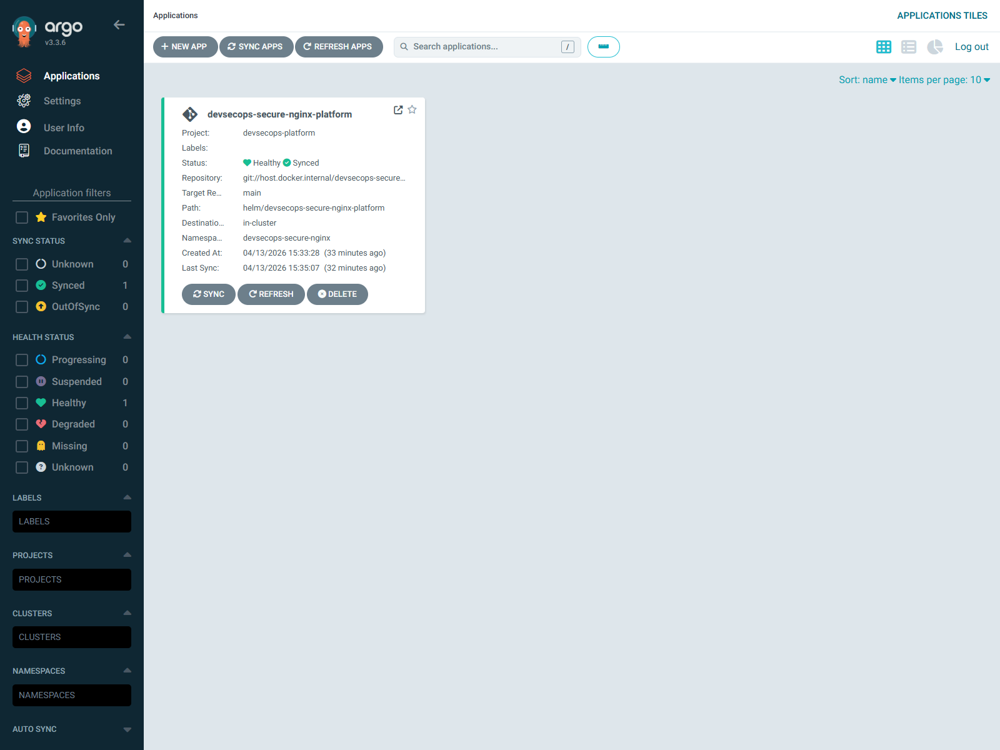
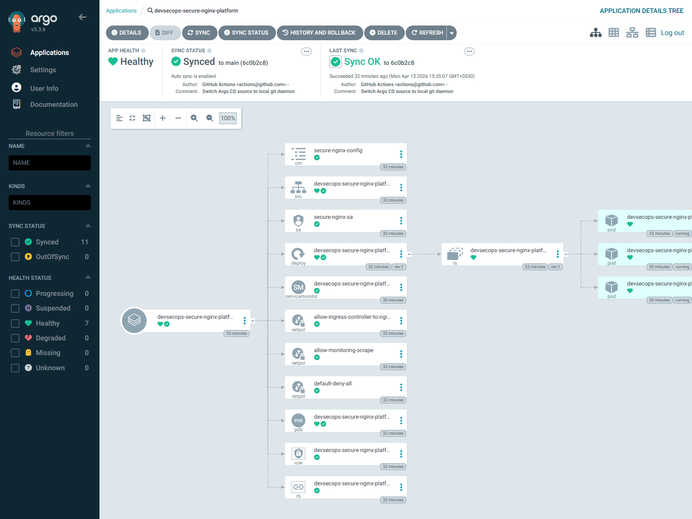
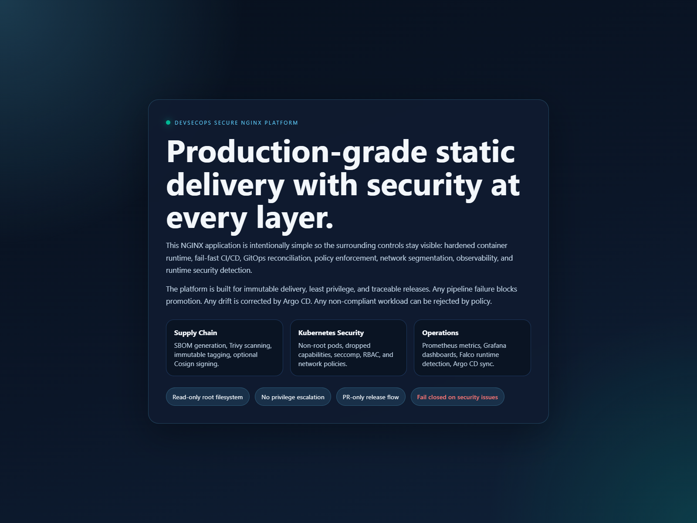
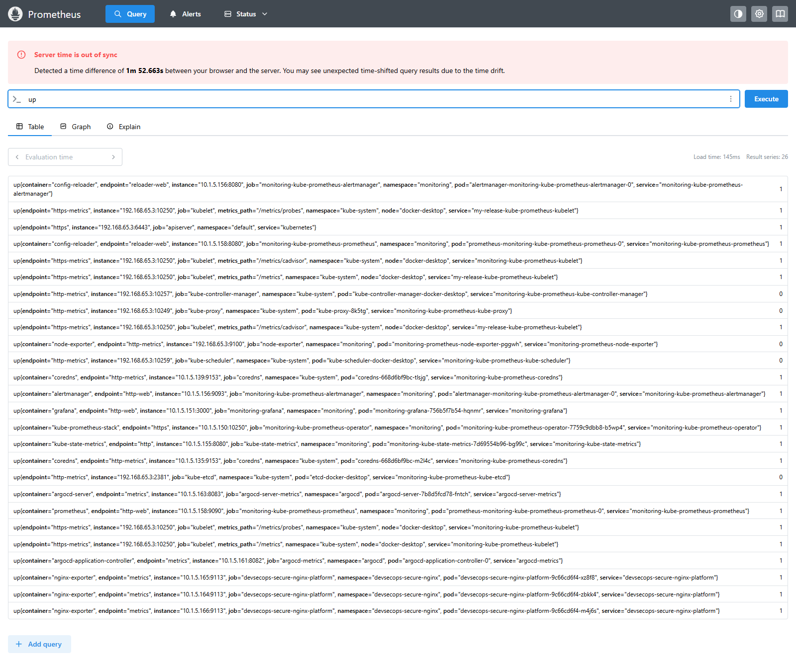

# devsecops-secure-nginx-platform

`devsecops-secure-nginx-platform` is a production-grade DevSecOps reference implementation for a hardened NGINX static application delivered through a secure GitHub Actions pipeline and deployed with Argo CD into Kubernetes with policy enforcement, network isolation, runtime monitoring, and supply chain controls.

## Architecture

The platform is designed around defense in depth:

1. Developers work on short-lived feature branches and open pull requests into `main`.
2. GitHub Actions validates code, scans for secrets, runs SAST, performs filesystem vulnerability scanning, builds the image, generates an SBOM, scans the image, and blocks merges on any issue.
3. The release workflow tags container images with both `VERSION` and commit SHA, pushes to Docker Hub, and can sign images with Cosign.
4. Argo CD watches the Git repository and continuously reconciles the Helm chart into the cluster with automated sync, prune, and self-heal enabled.
5. Kubernetes runs the application with strict pod security settings, least-privilege RBAC, resource limits, probes, read-only filesystem, and isolated network policies.
6. Kyverno policies enforce baseline security rules across workloads.
7. Vault provides runtime secret delivery without hardcoding secrets in Git.
8. Prometheus, Grafana, and Falco provide observability and runtime security visibility.

## Repository Layout

```text
.
|-- .github/
|   |-- CODEOWNERS
|   |-- pull_request_template.md
|   `-- workflows/
|-- app/
|-- argocd/
|-- docker/
|-- helm/
|-- kubernetes/
|-- monitoring/
|-- scripts/
|-- security/
|-- .dockerignore
|-- .gitignore
|-- Makefile
`-- VERSION
```

## Security Layers

### Code

- Pull request workflow only
- Required review ownership via `CODEOWNERS`
- Semgrep SAST rules
- Gitleaks secret scanning
- Trivy filesystem scanning

### CI/CD

- Sequential fail-fast validation jobs
- Immutable image tagging using semantic version plus commit SHA
- SBOM generation with Syft
- Container vulnerability scanning with Trivy
- Optional Cosign signing during release
- Docker Hub push only after all controls pass

### Container

- Trusted minimal unprivileged NGINX base image
- Non-root execution
- Static content copied with explicit ownership
- Runtime hardening enforced in Kubernetes:
  - `readOnlyRootFilesystem: true`
  - `allowPrivilegeEscalation: false`
  - all Linux capabilities dropped
  - seccomp profile set to `RuntimeDefault`

### Kubernetes

- Dedicated namespace
- Least-privilege service account and RBAC
- Liveness and readiness probes
- Resource requests and limits
- PodDisruptionBudget
- Default-deny network policies with explicit allow rules

### Policy Enforcement

Kyverno policies enforce:

- non-root containers
- privileged containers blocked
- resource requests and limits required

### Secrets Management

- HashiCorp Vault OSS for runtime secret delivery
- Kubernetes auth enabled for workload identity
- No secrets committed to the repository
- GitHub Actions uses GitHub encrypted secrets for CI credentials

### Runtime and Monitoring

- Prometheus scraping via `ServiceMonitor`
- Grafana dashboard for CPU, memory, pod restarts, request rate, and 5xx rate
- Falco runtime detection hooks

## Setup

### Prerequisites

- Docker
- Kubernetes cluster with a CNI that supports network policies
- Argo CD
- Helm
- Kyverno
- Vault OSS
- Prometheus Operator or `kube-prometheus-stack`
- Grafana
- Falco
- Docker Hub repository

### 1. Clone and Configure

```bash
git clone https://github.com/acme-platform/devsecops-secure-nginx-platform.git
cd devsecops-secure-nginx-platform
```

Set the GitHub repository secrets:

- `DOCKERHUB_USERNAME`
- `DOCKERHUB_TOKEN`
- `DOCKERHUB_REPOSITORY`
- `COSIGN_PRIVATE_KEY` optional
- `COSIGN_PASSWORD` optional

### 2. Build and Scan Locally

```bash
make test
make scan
make docker-build
make sbom
```

### 3. Install Cluster Dependencies

```bash
helm repo add argo https://argoproj.github.io/argo-helm
helm repo add kyverno https://kyverno.github.io/kyverno/
helm repo add hashicorp https://helm.releases.hashicorp.com
helm repo add prometheus-community https://prometheus-community.github.io/helm-charts
helm repo add falcosecurity https://falcosecurity.github.io/charts
helm repo update
```

Install Vault:

```bash
helm upgrade --install vault hashicorp/vault \
  --namespace vault \
  --create-namespace \
  -f security/vault/vault-values.yaml
```

Install monitoring:

```bash
helm upgrade --install monitoring prometheus-community/kube-prometheus-stack \
  --namespace monitoring \
  --create-namespace \
  -f monitoring/prometheus-values.yaml \
  -f monitoring/grafana-values.yaml
```

Install Falco:

```bash
helm upgrade --install falco falcosecurity/falco \
  --namespace falco \
  --create-namespace \
  -f security/falco/falco-values.yaml
```

Install Kyverno:

```bash
helm upgrade --install kyverno kyverno/kyverno \
  --namespace kyverno \
  --create-namespace
kubectl apply -f security/kyverno/
```

### 4. Configure Vault for the Workload

```bash
chmod +x security/vault/configure-vault.sh
./security/vault/configure-vault.sh
```

### 5. Deploy with Argo CD

```bash
kubectl apply -f argocd/project.yaml
kubectl apply -f argocd/application.yaml
```

Argo CD will automatically render the Helm chart from `helm/devsecops-secure-nginx-platform` and deploy the workload into the `devsecops-secure-nginx` namespace.

## CI/CD Flow

### Feature Branch Workflow

- Trigger: pushes to `feature/**`, `bugfix/**`, and `hotfix/**`
- Runs lightweight verification:
  - HTML validation test
  - secret scanning
  - SAST
  - repository filesystem scan

### Pull Request Validation Workflow

- Trigger: PRs targeting `main`
- Runs fail-fast validation in sequence:
  1. tests
  2. Semgrep
  3. Gitleaks
  4. Trivy filesystem scan
  5. Docker build with immutable tags
  6. SBOM generation
  7. Trivy image scan with `HIGH` and `CRITICAL` threshold

### Release Workflow

- Trigger: merge to `main` or manual dispatch
- Re-runs all validation gates
- Pushes versioned and SHA-tagged image to Docker Hub
- Optionally signs the image with Cosign if keys are configured

## GitOps Flow

1. A reviewed PR merges to `main`.
2. The release workflow publishes the container image with immutable tags.
3. The Helm values or manifest image tag is updated in Git through the normal delivery process.
4. Argo CD detects the Git change.
5. Argo CD auto-syncs, prunes stale resources, and self-heals drift.

### Rollback with Argo CD

Rollback is Git-native and Argo CD-native:

- Preferred method: revert the Git commit that introduced the bad change and let Argo CD sync the previous desired state.
- Operational method: use Argo CD UI or CLI to roll back to a previous healthy revision, then reconcile Git so the desired state stays aligned.

## Monitoring

The `ServiceMonitor` enables Prometheus scraping for the application. The included Grafana dashboard tracks:

- container CPU usage
- container memory usage
- pod restart count
- ingress HTTP request rate
- ingress 5xx rate

Load the dashboard JSON from `monitoring/grafana-dashboard-devsecops-secure-nginx-platform.json` into Grafana, or mount it through Grafana sidecar dashboards.

## Deployment Evidence (Ordered Screenshots)

The following screenshots are captured from the local Docker Desktop Kubernetes deployment and are ready to embed in demos, reports, and PR descriptions.

### 1. Argo CD Applications View



### 2. Argo CD Application Detail (Sync + Health)



### 3. Application UI (NGINX Secure Landing Page)



### 4. Grafana Dashboard


### 5. Prometheus Query Evidence



## Result Artifacts

These text artifacts capture command outputs used as deployment proof:

- `artifacts/results/argocd-apps.txt`
- `artifacts/results/argocd-app-detail.yaml`
- `artifacts/results/k8s-workload.txt`
- `artifacts/results/k8s-networkpolicy.txt`
- `artifacts/results/gatekeeper-constraints.txt`
- `artifacts/results/gatekeeper-templates.txt`
- `artifacts/results/trivy-fs.txt`

## How To Capture These Screenshots Yourself

Use this sequence whenever you need fresh evidence for README or audits:

1. Start port-forward sessions:
   - `kubectl port-forward -n devsecops-secure-nginx svc/devsecops-secure-nginx-platform 8080:80`
   - `kubectl port-forward -n argocd svc/argocd-server 8081:443`
   - `kubectl port-forward -n monitoring svc/monitoring-grafana 3001:80`
   - `kubectl port-forward -n monitoring svc/monitoring-kube-prometheus-prometheus 9091:9090`
2. Open endpoints:
   - App: `http://127.0.0.1:8080`
   - Argo CD: `https://127.0.0.1:8081`
   - Grafana: `http://127.0.0.1:3001`
   - Prometheus: `http://127.0.0.1:9091`
3. Capture screenshots in the same order used above and store them under `artifacts/screenshots/`.
4. Capture validation outputs into `artifacts/results/` (for example, `kubectl get ...`, `trivy fs ...`).
5. Commit both screenshot and result artifacts so README references remain valid.

## Branch Protection Strategy

Repository administrators should enforce the policy described in `security/github-branch-protection.md`:

- PR-only changes to `main`
- minimum 2 approvals
- CODEOWNERS review required
- status checks required for PR validation workflow
- force pushes and direct pushes blocked

## Local Commands

```bash
make help
make test
make scan
make docker-build
make k8s-apply
make helm-template
```

## Notes

- The app intentionally remains simple while the platform surrounding it reflects enterprise controls.
- The Grafana HTTP metrics panels assume `ingress-nginx` metrics are available in Prometheus.
- The release workflow is wired for immutable provenance and supports Cosign signing when secrets are configured.
